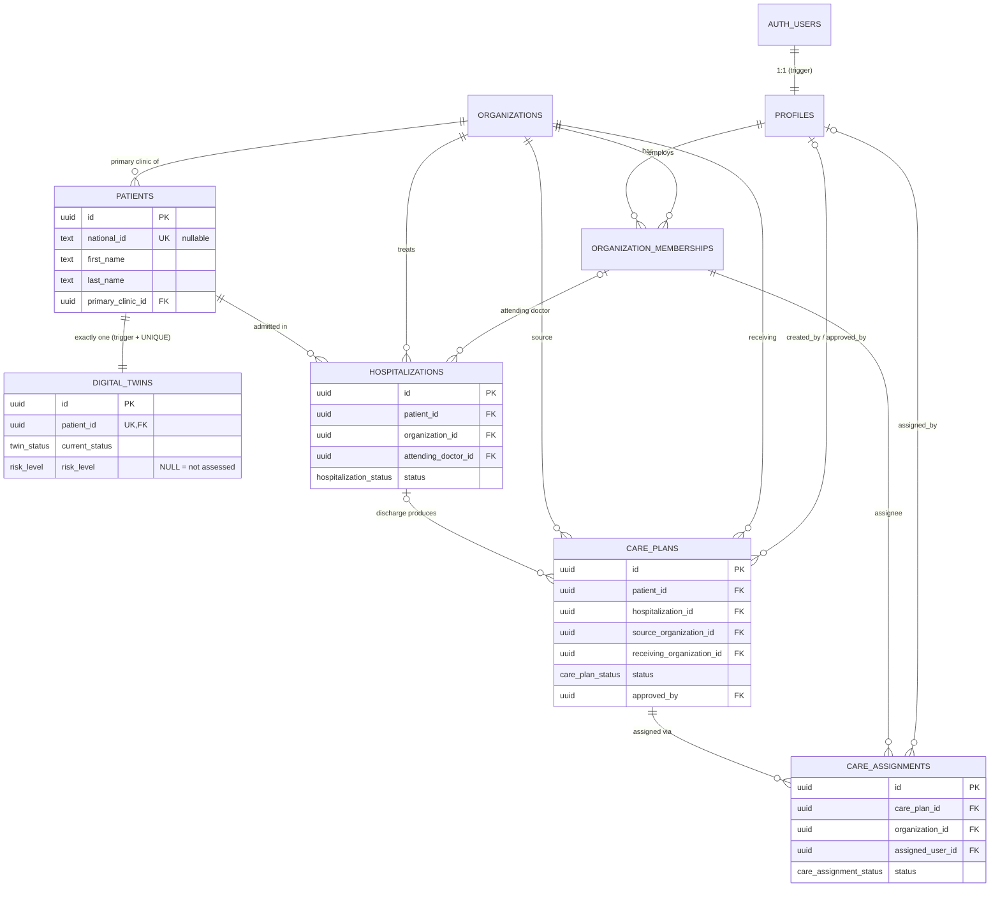
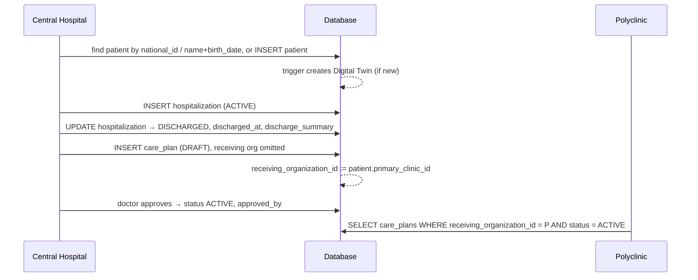

# TwinCare — Database Architecture (Stages 1–2)

Migrations:
- Stage 1 — [`20260924223000_initial_healthcare_schema.sql`](../supabase/migrations/20260924223000_initial_healthcare_schema.sql)
- Stage 2 — [`20260925120000_stage2_clinical_data.sql`](../supabase/migrations/20260925120000_stage2_clinical_data.sql)
- Fix — [`20260925130000_fix_old_record_on_insert.sql`](../supabase/migrations/20260925130000_fix_old_record_on_insert.sql)
- Patient number — [`20260925140000_patient_display_number.sql`](../supabase/migrations/20260925140000_patient_display_number.sql)
- Wearable enums — [`20260925150000_wearable_enum_values.sql`](../supabase/migrations/20260925150000_wearable_enum_values.sql)
- Devices — [`20260925160000_devices_and_wearables.sql`](../supabase/migrations/20260925160000_devices_and_wearables.sql)
- RLS — [`20260925170000_rls_policies.sql`](../supabase/migrations/20260925170000_rls_policies.sql)
Dev seed: [`supabase/seed.sql`](../supabase/seed.sql)

## 1. Overview

The schema has three groups of tables:

- **Identity and organizations:** who the staff are and where they work (`profiles`, `organizations`, `organization_memberships`).
- **Patient and care continuity:** the patient, their single Digital Twin, and the care episodes that give organizations a relationship to that twin (`patients`, `digital_twins`, `hospitalizations`, `care_plans`, `care_assignments`).
- **Clinical content of the twin (Stage 2):** the normalized medical record (`diagnoses`, `observations`, `lab_results`, `medications`, `procedures`, `allergies`) plus the append-only timeline (`twin_events`).

Conventions: UUID primary keys (`gen_random_uuid()`), `timestamptz` everywhere, PostgreSQL enums for statuses and roles, `updated_at` maintained by triggers, `ON DELETE RESTRICT` for anything clinical (deactivate with `is_active` instead of deleting).

## 2. Tables

### `profiles`
1:1 with `auth.users` (`id` is both PK and FK, cascade on auth user delete). Created automatically by the `on_auth_user_created` trigger, which copies `first_name`, `last_name` and `phone` from sign-up metadata. It **never** reads roles from metadata, because users control their own metadata. Holds no organization data.

### `organizations`
Hospitals, polyclinics, private clinics, rehabilitation centers (`organization_type` enum). Has an address, region/district, and coordinates validated to legal lat/long ranges.

### `organization_memberships`
Joins a user to an organization with a `membership_role`: `SUPER_ADMIN`, `ORGANIZATION_ADMIN`, `HOSPITAL_DOCTOR`, `POLYCLINIC_DOCTOR`, `NURSE`. `UNIQUE (organization_id, user_id)` blocks duplicates.

### `patients`
Demographics and contact details. `national_id` (PINFL) is nullable (for unidentified admissions) but unique when present. `telegram_id` is a unique `bigint`, ready for the Telegram bot. `primary_clinic_id` is the territorial polyclinic. **No organization owns a patient.**

Two identifiers, with different jobs:

| Column | Type | Role |
|---|---|---|
| `id` | `uuid` | Primary key. Every foreign key, every API route, every authorization check. |
| `patient_number` | `bigint` identity | Medical record number shown to humans — 1, 2, 3 … Assigned by the database, never set by application code, never reused. |

`patient_number` is a **label**. It is sequential and therefore enumerable, so nothing may authorize on it: route and query on the uuid and let RLS decide visibility. Format it in the UI (`P-000042`) rather than storing a formatted string.

### `digital_twins`
Identity and current state of the twin only: `current_status` (`NEW`, `HOSPITALIZED`, `POST_DISCHARGE_MONITORING`, `STABLE`, `INACTIVE`), `risk_level` (`LOW` to `CRITICAL`, `NULL` = not yet assessed) and `last_updated_at`. There is deliberately **no JSON blob of history**; history goes into the normalized Stage 2 tables.

### `hospitalizations`
An inpatient episode (`ACTIVE`, `DISCHARGED`, `TRANSFERRED`, `CANCELLED`). Rules:
- `discharged_at >= admitted_at`
- `ACTIVE` ⇒ `discharged_at IS NULL`; `DISCHARGED`/`TRANSFERRED` ⇒ `discharged_at IS NOT NULL`
- at most one `ACTIVE` hospitalization per patient (partial unique index)
- `attending_doctor_id` must be a member of the treating organization (composite FK to memberships)

### `care_plans`
The post-discharge hand-over from a source organization to a receiving organization (`DRAFT`, `PENDING_APPROVAL`, `ACTIVE`, `COMPLETED`, `CANCELLED`). Rules:
- `receiving_organization_id` **defaults to the patient's `primary_clinic_id`** if omitted on insert. The insert fails if the patient has no primary clinic.
- When linked to a hospitalization, patient and source organization must match it (composite FK).
- `ACTIVE`/`COMPLETED` require `approved_by`. `DRAFT`/`PENDING_APPROVAL` must not have one. `approved_by` and `approved_at` are set together, and `approved_at` is filled automatically.
- The approver must be an active `HOSPITAL_DOCTOR` or `POLYCLINIC_DOCTOR` of the source or receiving organization.
- A plan can't become `ACTIVE` while its hospitalization is still `ACTIVE`.
- `created_by` may be `NULL` for system/AI-generated drafts.

### `care_assignments`
Gives follow-up responsibility to a specific worker (`PENDING`, `ACCEPTED`, `ACTIVE`, `COMPLETED`, `CANCELLED`). Rules:
- Its patient and organization must match the care plan's patient and **receiving** organization (composite FK).
- The assignee must be an active `NURSE` or `POLYCLINIC_DOCTOR` member of that organization.
- `assigned_by` must be that organization's `ORGANIZATION_ADMIN` or a `SUPER_ADMIN`.
- Only `ACTIVE` (approved) care plans can be assigned.
- `ACCEPTED`/`ACTIVE`/`COMPLETED` require `accepted_at`; `COMPLETED` requires `completed_at`; timestamps must be in order.
- A worker can hold only one open (`PENDING`/`ACCEPTED`/`ACTIVE`) assignment per plan.

## 2b. Stage 2 — clinical tables

Every clinical table repeats the same provenance block, because the twin must be able to answer *who recorded this, when it happened and where it came from*: `patient_id`, `recorded_by` → `profiles`, `organization_id` → `organizations`, and a `clinical_source` enum (`HOSPITAL`, `POLYCLINIC`, `NURSE`, `PATIENT`, `DEVICE`, `AI_DRAFT`). When both `organization_id` and the recorder are present, a composite FK to `organization_memberships` proves the recorder actually works there; `MATCH SIMPLE` skips the check for patient-reported rows, which have neither.

Episode links (`hospitalization_id`, `care_plan_id`) are nullable and use composite FKs against `(id, patient_id)`, so a clinical row can never point at another patient's episode.

### `diagnoses`
Chronic history and episode diagnoses in one table. `type` (`PRIMARY`, `SECONDARY`, `COMORBIDITY`, `COMPLICATION`), `status` (`ACTIVE`, `RESOLVED`, `IN_REMISSION`, `RULED_OUT`), ICD-10 in `code` as plain text. Dates, not timestamps — the onset hour of a chronic condition is never known. `RESOLVED` requires `resolved_at`.

### `observations`
The hot table: one row = one measurement event. Clinical vitals and patient-reported symptoms live together so a ward temperature and a Telegram-reported temperature plot on the same line; `source` keeps them distinguishable. `value_numeric` / `value_secondary` (diastolic, `BLOOD_PRESSURE` only, so 140/90 stays one row) / `value_boolean` / `value_text`, with `unit`. `recorded_at` is when the measurement was **taken**, distinct from `created_at` (when it reached the database). `is_abnormal` is set by a clinician or the Stage 8 risk engine.

### `lab_results`
Kept apart from observations because labs carry `panel`, `analyte`, `reference_low`/`reference_high`, a `flag` (`LOW`/`NORMAL`/`HIGH`/`CRITICAL`, derived from the reference range on write when not supplied) and a `collected_at` / `resulted_at` distinction. Rule of thumb: a finger-prick glucose at home is an observation, a venous panel is a lab result.

### `medications`
Name, `dose`/`dose_unit`, `frequency` enum (what reminder generation reads) with `frequency_text` for anything the enum cannot express, `route`, `instructions`, course window and `status`. Discharge medication carries `care_plan_id`. Adherence tracking is deliberately absent — it belongs to Stage 7 with the bot.

### `procedures`
Surgery, imaging, diagnostic and therapeutic interventions with `performed_at` and `performed_by`. Small, but it places the surgery marker on the timeline.

### `allergies`
`substance`, `reaction`, `severity`, `status`. Intentionally minimal: it exists so the twin header can show a safety badge. One active row per substance per patient.

### `twin_events`
Append-only timeline, **not** a medical data store. Each row carries `event_type`, `occurred_at`, a pre-rendered `title` (so the timeline needs no joins), a `phase` (`HOSPITAL` | `HOME` — this single column draws the discharge split in the journey UI), a `severity`, and `(source_table, source_id)` pointing at the record it describes.

Two guarantees keep it honest:
- **Triggers are the only writer.** `log_twin_event()` is called from AFTER triggers on the six clinical tables and on `hospitalizations`, `care_plans`, `care_assignments` and `digital_twins`. Nothing else has `EXECUTE`, so the timeline cannot drift from the medical record.
- **It is immutable.** `twin_events_block_mutation()` rejects every UPDATE and DELETE.

`metadata` is for event-specific extras only. A value stored *only* there is invisible to trends, charts and the risk engine.

### Twin status synchronisation
The Stage 2 triggers also maintain `digital_twins`, closing the item left open in Stage 1: admission sets `HOSPITALIZED`, discharge and care-plan approval set `POST_DISCHARGE_MONITORING`, a completed plan with no other active plan returns the twin to `STABLE`, and every `log_twin_event()` call refreshes `last_updated_at` (what the "Updated 3m ago" header reads). Changes to `risk_level` are themselves recorded as `RISK_LEVEL_CHANGED` events.

## 2c. Connected devices (Stage 2.5)

Continuous passive monitoring closes the gap between Telegram check-ins: a rising resting heart rate and a falling HRV are visible overnight, hours before a patient notices anything worth reporting.

### `devices`
A wearable linked to a patient: `provider` (`WHOOP`, `APPLE_HEALTH`, `GOOGLE_FIT`, `FITBIT`, `GARMIN`, `OTHER`), `model`, `external_device_id`, `status`, `linked_at` / `unlinked_at` and `last_sync_at` for the "synced 4m ago" badge. One `ACTIVE` device per provider per patient. `is_simulated` marks demo hardware, and the UI must label those as synthetic.

### `private.device_connections`
Provider OAuth tokens, in the `private` schema. Supabase exposes only `public` through PostgREST, so these rows have no HTTP surface at all and are reachable only by the backend service role. **Never add `private` to the API's exposed schemas.**

### `device_sync_log`
One row per ingestion run: counts ingested and skipped, plus the failure reason. `observations_skipped` counts duplicates rejected by the idempotency key — a healthy resync skips, it does not duplicate.

### Where readings go
Into `observations`, the table the twin already reads. A device does not get a parallel medical record. Two columns were added for it:

- `device_id` — provenance, alongside the existing `source = 'DEVICE'`.
- `external_id` — the provider's own id for the reading. `UNIQUE (device_id, external_id)` makes ingestion idempotent; without it every re-sync would duplicate the patient's history.

Three rules keep this from swamping the system:

1. **Summaries only.** A wearable emits thousands of samples a day. Ingest the provider's aggregated daily values, plus anything crossing a threshold — never the raw stream.
2. **Routine telemetry is charted, not narrated.** `observations_after_insert()` skips `twin_events` for device readings unless `is_abnormal`. The observation row is always written, so trends and the risk engine still see everything; only the timeline is spared the noise.
3. **No blood pressure from wearables.** No wrist wearable measures BP to clinical standard, so `observation_type` has no wearable BP path. Blood pressure stays a cuff or clinician measurement with `source` `PATIENT` or `NURSE`.

Wearable-specific observation types: `HRV`, `RESTING_HEART_RATE`, `SKIN_TEMPERATURE_DELTA` (a deviation from baseline, not an absolute temperature), `SLEEP_DURATION`, `SLEEP_EFFICIENCY`, `STEPS`, `RECOVERY_SCORE`.

### Adding enum values
`ALTER TYPE … ADD VALUE` and the first *use* of that value cannot share a transaction, and Supabase wraps each migration file in one. That is why the labels live in their own migration (`…150000`) and everything using them is in the next (`…160000`). Keep that split for any future enum value.

## 3. Key relationships

| From | To | How |
|---|---|---|
| `auth.users` | `profiles` | 1:1, trigger-created |
| `profiles` | `organizations` | M:N through `organization_memberships` |
| `patients` | `organizations` | `primary_clinic_id` (territorial polyclinic) |
| `patients` | `digital_twins` | 1:1, trigger-created, `UNIQUE(patient_id)` |
| `hospitalizations` | `patients`, `organizations`, membership | treating org + attending doctor |
| `care_plans` | `hospitalizations` | composite FK `(id, patient_id, organization_id)` → source org |
| `care_assignments` | `care_plans` | composite FK `(id, patient_id, receiving_organization_id)` |
| `care_assignments` | `organization_memberships` | composite FK `(organization_id, user_id)` |

## 4. ONE PATIENT = ONE DIGITAL TWIN

Enforced three ways:
1. `digital_twins_patient_id_key UNIQUE (patient_id)`, so a second twin is impossible.
2. The `patients_create_digital_twin` trigger creates the twin in the same transaction as the patient, so a patient never exists without one.
3. The `digital_twins_before_update` trigger makes `patient_id` immutable, so a twin can't be moved to another patient.

Hospitals and polyclinics never copy the patient. A hospitalization gives the hospital a relationship to the twin. A care plan and care assignment give the polyclinic and its staff a relationship to the **same** twin.

## 5. Organization membership model

Roles live on memberships, not on profiles, because a clinician may work in several organizations with different roles (for example, a doctor at the central hospital who also consults at a private clinic). All future RLS checks will ask: *does the current user have an active membership with role X in organization Y?*

Limitation: one role per user per organization. If someone needs two roles in the same organization (for example, admin and nurse), give the membership the broader role, or later change the unique key to `(organization_id, user_id, role)`.

## 6. Discharge workflow

## 7. Care assignment workflow

1. The polyclinic `ORGANIZATION_ADMIN` sees the incoming `ACTIVE` care plan.
2. The admin inserts a `care_assignments` row (`PENDING`) for a nurse or polyclinic doctor.
3. The worker accepts: `status = ACCEPTED` (or `ACTIVE`) with `accepted_at = now()`.
4. Monitoring runs (Stage 2 check-ins, observations and alerts hang off the twin).
5. At the end: `status = COMPLETED`, `completed_at`, and usually the care plan goes to `COMPLETED`.

Reassignment: cancel the old assignment (`CANCELLED`) and create a new one.

## 8. What is still open

Implemented in Stage 2: `diagnoses`, `observations`, `lab_results`, `medications`, `procedures`, `allergies`, `twin_events`, plus twin status synchronisation.

Still to come:

| Table / work | Stage |
|---|---|
| `patient_check_ins` (Telegram sessions and answers) | 7 |
| `medication_intakes` (adherence) | 7 |
| `alerts` (risk engine output, review workflow) | 8 |
| `clinical_notes` | later |
| Real provider OAuth + webhook ingestion (the schema is ready; only a simulator is seeded) | later |
| Audit log | later |

## 9. Security and RLS

RLS is enabled on every table, and every table now has policies. `anon` has all privileges revoked everywhere.

### The one access rule

All patient-scoped policies defer to `private.can_access_patient(patient_id)`, which grants access through five routes:

| Route | Who it serves |
|---|---|
| `SUPER_ADMIN` membership | platform administration |
| a hospitalization of that patient in one of my organizations | hospital doctors, org admins |
| a care plan whose source or receiving organization is mine | both sides of the hand-over |
| the patient is registered to my clinic (`primary_clinic_id`) | the territorial population of a polyclinic |
| a care assignment made to me personally | **nurses — their only route** |

Organization-wide routes are limited to `ORGANIZATION_ADMIN`, `HOSPITAL_DOCTOR` and `POLYCLINIC_DOCTOR` (`private.patient_access_org_ids()`). `NURSE` is excluded on purpose: working at a polyclinic does not grant access to every patient of that polyclinic.

### Why the helpers are `SECURITY DEFINER`

`can_access_patient()` reads `hospitalizations`, `care_plans` and `care_assignments` — tables whose own policies call `can_access_patient()`. Running as the table owner skips RLS inside the function, which is what prevents infinite recursion. The function returns only a boolean about the caller, so it leaks nothing.

The helpers live in `private`, which is not in the PostgREST exposed schemas, so they are not callable over HTTP. `authenticated` holds `EXECUTE` because policy expressions are evaluated as the calling user. `private.device_connections` keeps its own zero grants and is still unreachable.

### Performance

Every helper is `STABLE` and every policy wraps the call as `(select private.…)`, so PostgreSQL evaluates it once per statement as an InitPlan rather than once per row. Dropping that wrapper turns a patient list into one function call per row.

### Write model

Grants start at read-only for `authenticated`; writes are handed back table by table.

| Table | Insert | Update |
|---|---|---|
| `patients` | clinician/admin, as `created_by = auth.uid()` | any accessible patient |
| `hospitalizations` | `HOSPITAL_DOCTOR` / `ORGANIZATION_ADMIN` of the treating org | same (this is how discharge happens) |
| `care_plans` | a doctor/admin of the source org | source **or** receiving org (this is how approval happens) |
| `care_assignments` | `ORGANIZATION_ADMIN` of the receiving org | the assignee (accept/complete) or that admin |
| `diagnoses`, `observations`, `lab_results`, `procedures`, `allergies` | clinician, for an accessible patient, under their own name | author only |
| `medications` | **doctors only** — nurses cannot prescribe | prescriber only |
| `devices` | clinician, for an accessible patient | same |
| `twin_events`, `digital_twins`, `device_sync_log` | — | — |

Two invariants fall out of this:

- **Authorship cannot be forged.** Every clinical INSERT policy requires the authorship column (`recorded_by` / `prescribed_by` / `performed_by`) to equal `auth.uid()`.
- **Nothing is deletable from a browser.** No `DELETE` grant and no `DELETE` policy exists on any table. Records are deactivated, not removed.

`twin_events` stays read-only: it is written exclusively by `SECURITY DEFINER` triggers, which bypass RLS, so no write policy is needed.

### Still enforced by triggers, not policies

Policies answer *may this user touch this row*. Finer clinical rules stay in the triggers from Stages 1 and 2: only a doctor of the source or receiving organization may approve a care plan, only an `ACTIVE` plan may be assigned, and an assignee must be an active `NURSE` or `POLYCLINIC_DOCTOR` of that organization.

## 10. Applying and seeding

- **Supabase CLI:** `supabase link --project-ref <ref>` then `supabase db push`. For a local stack: `supabase start && supabase db reset` (runs migrations, then `seed.sql`).
- **Without the CLI:** paste the migration into Dashboard → SQL Editor and run it once.
- **Demo users:** create `doctor.demo@twincare.test`, `admin.demo@twincare.test` and `nurse.demo@twincare.test` via Dashboard → Authentication → Add user (or `supabase.auth.admin.createUser` on the backend), then run `seed.sql`. Never insert into `auth.users` directly.
